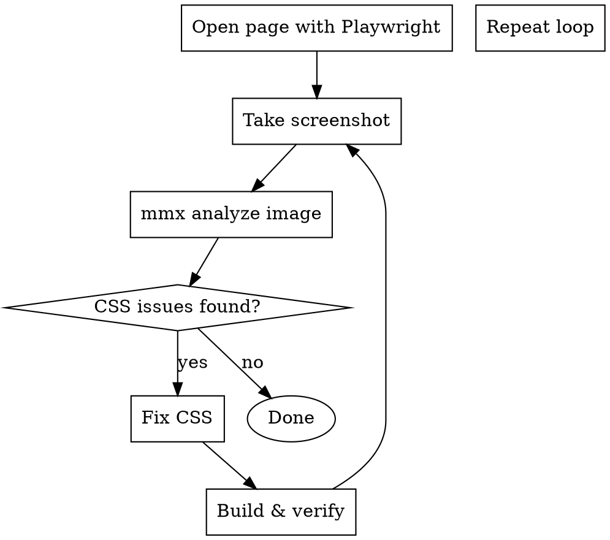

# Visual CSS Debugging with Playwright + mmxcli

## Overview

Debug frontend CSS issues using a feedback loop: Playwright navigates and captures, mmxcli analyzes visually, you fix based on AI feedback. Repeat until visually correct.

## When to Use

- CSS styles not applying correctly
- Layout issues (overflow, alignment, spacing)
- Visual bugs after code changes
- "CSS几乎完全没有" (CSS almost missing) symptoms
- Need visual verification before commit
- Component looks different than expected

## Core Pattern



## Quick Reference

| Step | Command | Purpose |
|------|---------|---------|
| Navigate | `mcp__plugin_playwright_playwright__browser_navigate` | Open URL |
| Screenshot | `mcp__plugin_playwright_playwright__browser_take_screenshot` | Capture visual |
| Console | `mcp__plugin_playwright_playwright__browser_console_messages` | Check errors |
| Analyze | `mmx vision describe --image <path>` | AI visual analysis |
| Wait | `mcp__plugin_playwright_playwright__browser_wait_for` | Wait for render |

## Step-by-Step Loop

### 1. Start dev server
```bash
npm run dev  # or pnpm run dev
# Note: port may auto-increment if default is in use
```

### 2. Navigate with Playwright
```
mcp__plugin_playwright_playwright__browser_navigate
  url: "http://localhost:<port>/<path>"
```

### 3. Wait for render
```
mcp__plugin_playwright_playwright__browser_wait_for
  time: 2
```

### 4. Check for errors
```
mcp__plugin_playwright_playwright__browser_console_messages
  level: "error"
```

### 5. Take screenshot
```
mcp__plugin_playwright_playwright__browser_take_screenshot
  type: "png"
  fullPage: true  # for full page capture
```

### 6. Analyze with mmxcli
```bash
mmx vision describe --image "<screenshot-path>" --prompt "详细描述CSS样式问题:1.整体布局 2.组件样式 3.缺少的视觉元素" --output json --quiet
```

### 7. Fix CSS based on feedback

### 8. Rebuild
```bash
pnpm run build  # MANDATORY before retest
```

### 9. Repeat from step 3 until no issues

## CSS Module Debugging Checklist

When CSS seems to have "no effect":

- [ ] Component using `className={styles.className}` (CSS module)?
- [ ] OR using `className="global-class"` (global CSS)?
- [ ] CSS file exists in same directory as component?
- [ ] CSS Module file named `*.module.css`?
- [ ] Import statement: `import styles from './Component.module.css'`?

**Common mistake:** Component uses `className="toolbar"` but CSS defines `.toolbar { }` in CSS Module. Fix: change to `className={styles.toolbar}`.

## Example: Fixing CSS Module Issue

**Symptom:** "CSS几乎完全没有" - Page renders but no styling

**Root cause:** Component using global class names instead of CSS module classes

**Debug loop:**
1. `browser_navigate` → page loads
2. `browser_take_screenshot` → capture "unstyled" page
3. `mmx vision describe` → confirms "纯HTML结构"
4. Check component: sees `className="workflow-toolbar"`
5. Check CSS: sees `.toolbar { }` in CSS module
6. Fix: change to `className={styles.toolbar}`
7. `pnpm run build` → rebuild
8. Repeat screenshot → verify fix

## mmx Prompt Templates

**General analysis:**
```
详细描述:1.页面的整体布局 2.各个组件的样式问题 3.缺少哪些视觉样式
```

**CSS fix verification:**
```
CSS样式修复后,请描述:1.页面整体视觉效果 2.各个组件的样式是否正确应用 3.是否还有样式问题
```

**Specific component:**
```
描述这个组件的样式,指出:1.颜色/字体/间距问题 2.布局问题 3.交互反馈缺失
```

## Anti-Patterns

- ❌ Skipping `pnpm run build` before retesting
- ❌ Using global CSS class names with CSS modules
- ❌ Forgetting to import CSS module in component
- ❌ Not waiting for React to render before screenshot
- ❌ Analyzing before taking new screenshot after fix

## Common CSS Module Fixes

| Problem | Wrong | Correct |
|---------|-------|---------|
| Global class | `className="btn"` | `className={styles.btn}` |
| Missing import | No import | `import styles from './X.module.css'` |
| Wrong path | `import './style.css'` | `import styles from './X.module.css'` |
| File naming | `component.css` | `component.module.css` |

## Real-World Example

See session transcript for complete workflow:
- Workflow module CSS debugging: 7 components fixed
- Used 3 iterations of Playwright → mmx → fix → build loop
- Final result: "已达到上线使用的视觉标准"
