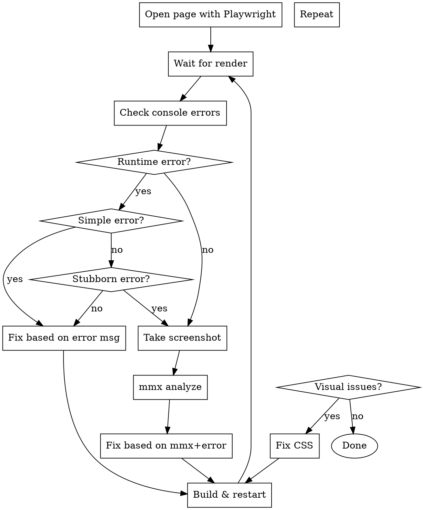

# Visual CSS Debugging with Playwright + mmxcli

## Overview

Debug frontend issues using a feedback loop: Playwright navigates and captures, mmxcli analyzes visually, you fix based on feedback. Repeat until correct.

**Two debugging modes:**
1. **Runtime check** - Page load errors, console errors, React crashes
2. **Visual check** - CSS not applying, layout issues, missing styles

## When to Use

- Page won't load or shows blank
- "Unexpected Application Error" in browser
- Console errors: "Hooks violated", "Cannot read properties of null"
- CSS styles not applying correctly
- Layout issues (overflow, alignment, spacing)
- Visual bugs after code changes
- "CSS几乎完全没有" (CSS almost missing) symptoms
- Need visual verification before commit

## Complete Debug Loop



## Quick Reference

| Step | Command | Purpose |
|------|---------|---------|
| Navigate | `mcp__plugin_playwright_playwright__browser_navigate` | Open URL |
| Screenshot | `mcp__plugin_playwright_playwright__browser_take_screenshot` | Capture visual |
| Snapshot | `mcp__plugin_playwright_playwright__browser_snapshot` | DOM structure |
| Console | `mcp__plugin_playwright_playwright__browser_console_messages` | Check errors |
| Analyze | `mmx vision describe --image <path>` | AI visual analysis |
| Wait | `mcp__plugin_playwright_playwright__browser_wait_for` | Wait for render |

## Step 1: Runtime Error Detection

Before visual debugging, check for runtime errors that prevent page from loading.

### Navigate to page
```
mcp__plugin_playwright_playwright__browser_navigate
  url: "http://localhost:<port>/<path>"
```

### Wait for initial render
```
mcp__plugin_playwright_playwright__browser_wait_for
  time: 3
```

### Check console errors immediately
```
mcp__plugin_playwright_playwright__browser_console_messages
  level: "error"
```

### Snapshot check for error boundary
```
mcp__plugin_playwright_playwright__browser_snapshot
```

Look for:
- `Unexpected Application Error` heading
- Error message details
- Stack trace location

### If Runtime Error Found

**For simple errors:** Apply fix based on error message, rebuild, retest.

**For difficult/stubborn errors:** Use mmx visual analysis loop even for runtime errors:

1. **Take screenshot of error page**
2. **Analyze with mmx**: `mmx vision describe --image "<path>" --prompt "描述页面显示的错误状态,分析错误信息,指出可能的代码问题"`
3. **Get mmx's perspective** on what might be wrong
4. **Apply fix** based on combined analysis
5. **Rebuild and retest**
6. **Repeat loop** until error resolved

### Common Runtime Errors

| Error Message | Likely Cause | Fix |
|--------------|--------------|-----|
| "Should have a queue. You are likely calling Hooks conditionally" | useCallback inside useMemo | Move hooks to top level |
| "Cannot read properties of null (reading 'useEffect')" | React version mismatch, module not loaded | Check imports, React version |
| "Failed to fetch dynamically imported module" | Stale Vite cache, module not found | Clear .vite cache, restart dev server |
| "is not exported by module" | Wrong import path | Check export/import paths |
| "TypeError: Failed to fetch" | Network error, port issue | Restart dev server |

### For Stubborn Runtime Errors

When errors persist after applying standard fixes:

1. **Screenshot error state** - even if showing error boundary
2. **Use mmx to analyze**: mmx can sometimes identify visual patterns that indicate root cause
3. **Check mmx response for patterns**:
   - "空白页面" → module not loading
   - "错误边界显示" → React error caught but not handled
   - "部分渲染" → hydration or data loading issue
4. **Combine mmx insight with console error** for better diagnosis
5. **Iterate fix → build → test loop**

## Step 2: Visual CSS Debugging

After confirming no runtime errors, proceed to visual verification.

### Take screenshot
```
mcp__plugin_playwright_playwright__browser_take_screenshot
  type: "png"
  fullPage: true  # for full page capture
```

### Analyze with mmxcli
```bash
mmx vision describe --image "<screenshot-path>" --prompt "详细描述:1.整体布局 2.组件样式问题 3.缺少的视觉元素" --output json --quiet
```

### Fix CSS based on feedback

### Rebuild
```bash
pnpm run build  # MANDATORY before retest
```

### Restart dev server if needed
```bash
pkill -f "vite"  # Kill existing
npm run dev      # Restart
```

### Repeat from Step 1 until correct

## CSS Module Debugging Checklist

When CSS seems to have "no effect":

- [ ] Component using `className={styles.className}` (CSS module)?
- [ ] OR using `className="global-class"` (global CSS)?
- [ ] CSS file exists in same directory as component?
- [ ] CSS Module file named `*.module.css`?
- [ ] Import statement: `import styles from './Component.module.css'`?

**Common mistake:** Component uses `className="toolbar"` but CSS defines `.toolbar { }` in CSS Module. Fix: change to `className={styles.toolbar}`.

## Example: Fixing CSS Module Issue

**Symptom:** "CSS几乎完全没有" - Page renders but no styling

**Root cause:** Component using global class names instead of CSS module classes

**Debug loop:**
1. `browser_navigate` → page loads
2. `browser_take_screenshot` → capture "unstyled" page
3. `mmx vision describe` → confirms "纯HTML结构"
4. Check component: sees `className="workflow-toolbar"`
5. Check CSS: sees `.toolbar { }` in CSS module
6. Fix: change to `className={styles.toolbar}`
7. `pnpm run build` → rebuild
8. Repeat screenshot → verify fix

## mmx Prompt Templates

**General analysis:**
```
详细描述:1.页面的整体布局 2.各个组件的样式问题 3.缺少哪些视觉样式
```

**CSS fix verification:**
```
CSS样式修复后,请描述:1.页面整体视觉效果 2.各个组件的样式是否正确应用 3.是否还有样式问题
```

**Specific component:**
```
描述这个组件的样式,指出:1.颜色/字体/间距问题 2.布局问题 3.交互反馈缺失
```

## Anti-Patterns

- ❌ Skipping `pnpm run build` before retesting
- ❌ Using global CSS class names with CSS modules
- ❌ Forgetting to import CSS module in component
- ❌ Not waiting for React to render before screenshot
- ❌ Analyzing before taking new screenshot after fix

## Common CSS Module Fixes

| Problem | Wrong | Correct |
|---------|-------|---------|
| Global class | `className="btn"` | `className={styles.btn}` |
| Missing import | No import | `import styles from './X.module.css'` |
| Wrong path | `import './style.css'` | `import styles from './X.module.css'` |
| File naming | `component.css` | `component.module.css` |

## Real-World Example

**Workflow module debugging session:**

### Round 1: Runtime Error
- Error: "Should have a queue. You are likely calling Hooks conditionally"
- Root cause: `useCallback` inside `useMemo` in store.js
- Fix: Move all `useCallback` outside `useMemo`
- Restart dev server

### Round 2: Visual Check
- Screenshot shows "CSS almost missing"
- mmx analysis: "纯HTML结构,缺乏现代Web应用质感"
- Root cause: Components using `className="global"` instead of CSS module `className={styles.class}`
- Fix: 7 components updated to use CSS modules
- 3 iterations to finalize

### Final Result
"已达到上线使用的视觉标准" - Modern flat design, proper layout, all components styled
